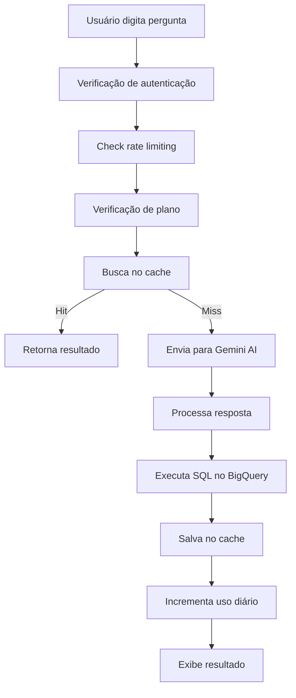
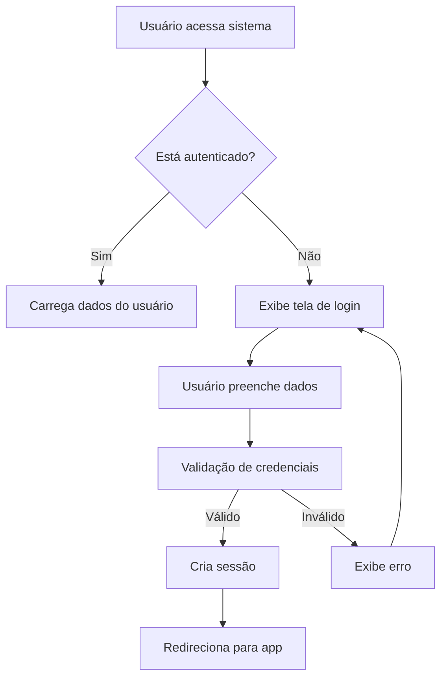
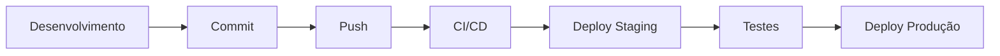

# 🤖 SQLLM - Sistema de Análise de Dados com IA

Sistema avançado de análise de dados utilizando inteligência artificial (Gemini) com interface Streamlit, sistema de autenticação, planos de assinatura e geração automática de consultas SQL.

## 📋 Índice

- [Visão Geral](#-visão-geral)
- [Arquitetura do Sistema](#-arquitetura-do-sistema)
- [Estrutura de Arquivos](#-estrutura-de-arquivos)
- [Componentes Principais](#-componentes-principais)
- [Fluxo de Dados](#-fluxo-de-dados)
- [Sistema de Autenticação](#-sistema-de-autenticação)
- [Sistema de Assinaturas](#-sistema-de-assinaturas)
- [Interface e Temas](#-interface-e-temas)
- [Configuração e Deploy](#-configuração-e-deploy)
- [Desenvolvimento](#-desenvolvimento)

---

## 🎯 Visão Geral

O SQLLM é uma aplicação web que permite aos usuários analisar dados através de consultas em linguagem natural, convertidas automaticamente em SQL pela IA do Google Gemini. O sistema inclui autenticação de usuários, planos de assinatura com diferentes limites e uma interface moderna e responsiva.

### � Funcionalidades Principais

- **Análise de Dados por IA**: Conversão de linguagem natural para SQL
- **Sistema de Autenticação**: Login/registro seguro com DuckDB
- **Planos de Assinatura**: Free, Premium, Enterprise com limites diferentes
- **Interface Moderna**: Tema escuro customizável, design responsivo
- **Cache Inteligente**: Sistema de cache para otimização de performance
- **Rate Limiting**: Controle de uso por usuário e plano
- **Exportação de Dados**: Excel, CSV e outros formatos

---

## 🏗️ Arquitetura do Sistema

```
┌─────────────────┐    ┌─────────────────┐    ┌─────────────────┐
│   FRONTEND      │    │    BACKEND      │    │    DATABASE     │
│   (Streamlit)   │    │   (Python)      │    │   (DuckDB)      │
├─────────────────┤    ├─────────────────┤    ├─────────────────┤
│ • Interface UI  │◄──►│ • Lógica de     │◄──►│ • Dados de      │
│ • Autenticação  │    │   Negócio       │    │   Usuários      │
│ • Planos        │    │ • API Gemini    │    │ • Assinaturas   │
│ • Dashboards    │    │ • Rate Limiting │    │ • Cache Queries │
└─────────────────┘    └─────────────────┘    └─────────────────┘
         │                        │                        │
         └────────────────────────┼────────────────────────┘
                                  │
                    ┌─────────────────┐
                    │  EXTERNAL APIs  │
                    ├─────────────────┤
                    │ • Google Gemini │
                    │ • BigQuery      │
                    │ • MercadoPago   │
                    └─────────────────┘
```

---

## 📁 Estrutura de Arquivos

### 🗂️ Organização Atual

```
sqllm/
├── 📱 INTERFACE (Streamlit)
│   ├── main.py                 # Página principal (chat IA)
│   ├── pages/
│   │   └── planos.py          # Página de planos de assinatura
│   └── .streamlit/            # Configurações Streamlit
│
├── 🎨 FRONTEND & TEMAS
│   ├── deepseek_theme.py      # Sistema de temas e UI
│   ├── style.py               # Estilos CSS adicionais
│   ├── image_utils.py         # Utilitários de imagem
│   └── config_menu.py         # Menu de configurações
│
├── 🔐 AUTENTICAÇÃO & USUÁRIOS
│   ├── auth_system.py         # Sistema de login/registro
│   ├── user_database.py       # Gerenciamento de usuários
│   └── users.db              # Banco de usuários (DuckDB)
│
├── 💳 SISTEMA DE ASSINATURAS
│   ├── subscription_system_db.py  # Lógica de assinaturas
│   ├── payment_ui_db.py           # Interface de pagamentos
│   └── payment_config.json       # Configurações de pagamento
│
├── 🤖 IA & PROCESSAMENTO
│   ├── gemini_handler.py      # Interface com Google Gemini
│   ├── database.py            # Conexões e queries SQL
│   ├── utils.py               # Utilitários gerais
│   └── message_handler.py     # Processamento de mensagens
│
├── 📊 CACHE & PERFORMANCE
│   ├── cache_db.py            # Sistema de cache
│   ├── query_cache.py         # Cache de consultas
│   ├── cache.db               # Banco de cache
│   └── rate_limit.py          # Controle de rate limiting
│
├── ⚙️ CONFIGURAÇÃO
│   ├── config.py              # Configurações principais
│   ├── client_config.json     # Config do cliente
│   ├── credentials.json       # Credenciais APIs
│   ├── .env                   # Variáveis de ambiente
│   └── requirements.txt       # Dependências Python
│
├── 📝 LOGS & MONITORING
│   ├── logger.py              # Sistema de logs
│   ├── logtable.sql          # Estrutura de logs
│   └── rate_limit_state.json # Estado do rate limiting
│
└── 🚀 DEPLOY
    ├── Procfile              # Configuração Heroku
    └── README.md             # Documentação (este arquivo)
```

### 📋 Proposta de Reestruturação (Futuro)

```
sqllm/
├── src/
│   ├── frontend/             # Interface Streamlit
│   │   ├── pages/
│   │   ├── components/
│   │   └── themes/
│   ├── backend/              # Lógica de negócio
│   │   ├── auth/
│   │   ├── subscriptions/
│   │   ├── ai/
│   │   └── database/
│   ├── utils/                # Utilitários
│   └── config/               # Configurações
├── data/                     # Bancos de dados
├── tests/                    # Testes automatizados
├── docs/                     # Documentação
└── deploy/                   # Scripts de deploy
```

---

## 🔧 Componentes Principais

### 1. 🎯 Sistema Principal (`main.py`)

**Responsabilidade**: Página principal do chat com IA

**Fluxo de Execução**:
```python
1. Configuração da página (set_page_config)
2. Verificação de autenticação (auth_system)
3. Aplicação de temas (deepseek_theme)
4. Renderização do sidebar (menu unificado)
5. Interface de chat (input/output)
6. Processamento IA (gemini_handler)
7. Cache e logs (cache_db)
```

**Dependências**:
- `auth_system`: Autenticação
- `config_menu`: Configurações
- `deepseek_theme`: Temas e UI
- `gemini_handler`: IA
- `subscription_system_db`: Assinaturas

### 2. 🔐 Sistema de Autenticação (`auth_system.py`)

**Responsabilidade**: Gerenciamento de usuários e sessões

**Componentes**:
```python
├── register_user()          # Registro de novos usuários
├── authenticate_user()      # Login
├── logout_user()           # Logout
├── get_current_user()      # Usuário da sessão
└── render_auth_system()    # Interface de auth
```

**Segurança**:
- Hash de senhas com salt
- Validação de email
- Controle de sessão
- Proteção contra ataques

### 3. 💳 Sistema de Assinaturas (`subscription_system_db.py`)

**Responsabilidade**: Gerenciamento de planos e pagamentos

**Planos Disponíveis**:
```python
├── free      # Gratuito: 10 consultas/dia
├── basic     # Básico: 50 consultas/dia  
├── premium   # Premium: 200 consultas/dia
└── enterprise # Enterprise: Ilimitado
```

**Funcionalidades**:
```python
├── get_user_subscription_info()  # Info do plano atual
├── change_user_plan()            # Upgrade/downgrade
├── get_daily_usage()             # Uso diário
├── increment_user_usage()        # Incrementa uso
└── check_feature_permission()    # Verifica permissões
```

### 4. 🤖 IA e Processamento (`gemini_handler.py`)

**Responsabilidade**: Interface com Google Gemini AI

**Processo**:
```python
1. Recebe pergunta em linguagem natural
2. Contextualiza com metadados de tabelas
3. Envia para Gemini AI
4. Processa resposta (SQL + explicação)
5. Executa query no BigQuery
6. Formata resultados para o usuário
```

**Configurações**:
- Modelo: gemini-1.5-flash
- Temperature: 0.1 (determinístico)
- Max tokens: 8192
- Safety settings configurados

### 5. 🎨 Sistema de Temas (`deepseek_theme.py`)

**Responsabilidade**: Interface visual e temas

**Componentes**:
```python
├── apply_deepseek_theme()      # Tema principal
├── render_theme_selector()     # Seletor de tema
├── create_usage_indicator()    # Indicador de uso
├── get_enhanced_cards_theme()  # Cards melhorados
└── fix_alert_visibility()     # Correção de alertas
```

**Características**:
- Tema escuro como padrão
- Gradientes azuis (#00d4ff)
- Design responsivo
- Componentes customizados

---

## 🔄 Fluxo de Dados

### 📊 Fluxo Principal de Consulta



### � Fluxo de Autenticação



### 💳 Fluxo de Upgrade de Plano

```mermaid
graph TD
    A[Usuário clica em plano] --> B[Validação de autenticação]
    B --> C[Mapeamento de plano]
    C --> D[change_user_plan()]
    D --> E[Atualização no banco]
    E --> F[Sucesso?]
    F -->|Sim| G[Atualiza UI]
    F -->|Não| H[Exibe erro]
    G --> I[Recarrega página]
```

---

## 🔐 Sistema de Autenticação

### 🏗️ Estrutura do Banco de Usuários

```sql
-- Tabela de usuários
CREATE TABLE users (
    id TEXT PRIMARY KEY,
    username TEXT UNIQUE NOT NULL,
    email TEXT UNIQUE NOT NULL,
    password_hash TEXT NOT NULL,
    created_at TIMESTAMP DEFAULT CURRENT_TIMESTAMP,
    last_login TIMESTAMP
);

-- Tabela de planos
CREATE TABLE subscription_plans (
    id TEXT PRIMARY KEY,
    name TEXT NOT NULL,
    description TEXT,
    price DECIMAL(10,2),
    daily_limit INTEGER,
    features TEXT,
    priority_support BOOLEAN
);

-- Tabela de assinaturas de usuários
CREATE TABLE user_subscriptions (
    subscription_id TEXT PRIMARY KEY,
    user_id TEXT,
    plan_id TEXT,
    start_date DATE,
    end_date DATE,
    FOREIGN KEY (user_id) REFERENCES users(id),
    FOREIGN KEY (plan_id) REFERENCES subscription_plans(id)
);
```

### 🛡️ Segurança Implementada

- **Hash de senhas**: Usando algoritmos seguros com salt
- **Validação de entrada**: Sanitização de dados
- **Controle de sessão**: Session state do Streamlit
- **Rate limiting**: Por usuário e por plano
- **Logs de auditoria**: Registro de acessos

---

## 💳 Sistema de Assinaturas

### 📦 Planos Disponíveis

| Plano | Preço | Consultas/Dia | Recursos |
|-------|-------|---------------|----------|
| **Gratuito** | R$ 0 | 10 | Interface básica, Suporte comunidade |
| **Básico** | R$ 29,90 | 50 | Relatórios básicos, Suporte email |
| **Premium** | R$ 59,90 | 200 | Relatórios avançados, Suporte prioritário |
| **Enterprise** | R$ 199,90 | Ilimitado | API dedicada, Suporte 24/7 |

### 🔄 Gestão de Limites

```python
def check_usage_limit(user_id):
    """Verifica se usuário ainda tem consultas disponíveis"""
    subscription = get_user_subscription_info(user_id)
    current_usage = get_daily_usage(user_id)
    
    if subscription['daily_limit'] == -1:  # Ilimitado
        return True
    
    return current_usage < subscription['daily_limit']
```

### � Integração de Pagamentos

- **MercadoPago**: Gateway principal
- **Webhook**: Confirmação automática
- **Logs**: Auditoria de transações

---

## 🎨 Interface e Temas

### 🌙 Tema Principal

**Cores Padrão**:
- **Primária**: #00d4ff (azul brilhante)
- **Background**: Gradiente escuro (#000000 → #1a1a1a)
- **Texto**: Branco (#ffffff)
- **Secundária**: #6b7280 (cinza)
- **Sucesso**: #10b981 (verde)
- **Erro**: #f87171 (vermelho)

**Componentes Customizados**:
```css
/* Botões */
.stButton > button {
    background: linear-gradient(45deg, #00d4ff, #0099cc);
    border: none;
    border-radius: 10px;
    font-weight: bold;
}

/* Sidebar */
.stSidebar {
    background: linear-gradient(180deg, #1a1a1a, #000000);
}

/* Cards */
.plan-card {
    border: 3px solid var(--plan-color);
    border-radius: 15px;
    background: linear-gradient(135deg, rgba(0, 212, 255, 0.05), rgba(0, 212, 255, 0.02));
}
```

### 📱 Responsividade

- **Mobile**: Layout adaptativo
- **Tablet**: Sidebar colapsível
- **Desktop**: Interface completa

---

## ⚙️ Configuração e Deploy

### 🔧 Variáveis de Ambiente

```bash
# .env
GOOGLE_API_KEY=your_gemini_api_key
BIGQUERY_PROJECT_ID=your_project_id
BIGQUERY_DATASET_ID=your_dataset_id
MERCADOPAGO_ACCESS_TOKEN=your_mp_token
```

### 📦 Dependências Principais

```txt
streamlit==1.44.1          # Framework web
google-generativeai        # Gemini AI
google-cloud-bigquery      # BigQuery
duckdb                     # Banco de dados
mercadopago                # Pagamentos
plotly                     # Gráficos
matplotlib                 # Visualizações
openpyxl                   # Excel export
```

### 🚀 Deploy Heroku

```bash
# Procfile
web: streamlit run main.py --server.port=$PORT --server.headless=true
```

**Comandos**:
```bash
git add .
git commit -m "Deploy"
git push heroku main
```

### 🐳 Deploy Docker (Futuro)

```dockerfile
FROM python:3.11-slim
WORKDIR /app
COPY requirements.txt .
RUN pip install -r requirements.txt
COPY . .
EXPOSE 8501
CMD ["streamlit", "run", "main.py"]
```

---

## 🛠️ Desenvolvimento

### 📋 Setup Local

```bash
# 1. Clone o repositório
git clone <repo-url>
cd sqllm

# 2. Crie ambiente virtual
python -m venv .venv
source .venv/bin/activate  # Linux/Mac
.venv\Scripts\activate     # Windows

# 3. Instale dependências
pip install -r requirements.txt

# 4. Configure variáveis de ambiente
cp .env.example .env
# Edite o .env com suas credenciais

# 5. Execute localmente
streamlit run main.py
```

### 🧪 Testes

```bash
# Testes de sintaxe
python -m py_compile *.py

# Linting
ruff check .
black --check .

# Testes funcionais (implementar)
pytest tests/
```

### 📊 Monitoramento

**Logs Disponíveis**:
- `logger.py`: Sistema de logs estruturado
- `cache_db.py`: Logs de cache e performance
- `auth_system.py`: Logs de autenticação
- Rate limiting: Estado e métricas

**Métricas Importantes**:
- Usuários ativos diários
- Consultas por usuário
- Performance de cache
- Erros de API
- Tempo de resposta

### 🔄 Workflow de Desenvolvimento



---

## 📈 Roadmap Futuro

### 🏗️ Melhorias de Arquitetura

1. **Reestruturação de Pastas**
   - Separar frontend/backend
   - Organizar por domínio
   - Criar estrutura de testes

2. **Banco de Dados**
   - Migrar para PostgreSQL
   - Implementar migrations
   - Backup automatizado

3. **Performance**
   - Cache Redis
   - CDN para assets
   - Otimização de queries

### 🚀 Novas Funcionalidades

1. **Dashboard Analytics**
   - Métricas de uso
   - Gráficos interativos
   - Relatórios automatizados

2. **API REST**
   - Endpoints públicos
   - Documentação Swagger
   - Rate limiting por API key

3. **Colaboração**
   - Workspaces de equipe
   - Compartilhamento de queries
   - Comentários e anotações

### 🔐 Segurança e Compliance

1. **Autenticação Avançada**
   - OAuth (Google, GitHub)
   - 2FA (Two-Factor Authentication)
   - SSO empresarial

2. **Compliance**
   - LGPD/GDPR
   - Auditoria completa
   - Criptografia de dados

---

## 📞 Suporte e Contribuição

### 🐛 Reportar Bugs

1. Verifique se já existe issue similar
2. Inclua informações detalhadas:
   - Versão do sistema
   - Passos para reproduzir
   - Logs relevantes
   - Screenshots se necessário

### 💡 Sugestões de Melhoria

1. Abra uma issue com label "enhancement"
2. Descreva o problema que resolve
3. Proponha uma solução
4. Inclua mockups se for UI

### 🤝 Contribuindo

1. Fork o repositório
2. Crie branch feature/bugfix
3. Implemente mudanças
4. Adicione testes se necessário
5. Abra Pull Request

---

## � Licença

Este projeto está sob licença proprietária. Todos os direitos reservados.

---

## 📚 Documentação Adicional

- [Documentação da API](docs/api.md)
- [Guia de Estilo](docs/style-guide.md)
- [Troubleshooting](docs/troubleshooting.md)
- [Changelog](CHANGELOG.md)

---

**Última atualização**: Outubro 2025  
**Versão**: 1.0.0  
**Autor**: Junio  
**Contato**: [email]
