# 🚀 SQLLM - Sistema de Análise de Dados com IA# 🚀 SQLLM - Sistema de Análise de Dados com IA


Sistema avançado de análise de dados que converte linguagem natural em consultas SQL usando IA (Google Gemini) com interface web Streamlit.Sistema avançado de análise de dados que converte linguagem natural em consultas SQL usando IA (Google Gemini) com interface web Streamlit.


## ✨ Principais Funcionalidades## ✨ Principais Funcionalidades


- **🤖 IA Conversacional**: Converte perguntas em linguagem natural para SQL- **🤖 IA Conversacional**: Converte perguntas em linguagem natural para SQL

- **🔄 Sistema RAG Duplo**: - **� Sistema RAG Duplo**: 

  - **Business RAG**: Contexto de negócio e metadados  - **Business RAG**: Contexto de negócio e metadados

  - **SQL Pattern RAG**: Padrões e templates SQL otimizados  - **SQL Pattern RAG**: Padrões e templates SQL otimizados

- **📊 Visualizações Inteligentes**: Gráficos automáticos baseados nos dados- **📊 Visualizações Inteligentes**: Gráficos automáticos baseados nos dados

- **♻️ Reutilização Inteligente**: Detecta quando pode reutilizar dados anteriores- **♻️ Reutilização Inteligente**: Detecta quando pode reutilizar dados anteriores

- **🎨 Interface Moderna**: Tema dark/light responsivo- **🎨 Interface Moderna**: Tema dark/light responsivo

- **👥 Sistema de Usuários**: Autenticação e controle de acesso- **👥 Sistema de Usuários**: Autenticação e controle de acesso

- **📈 Rate Limiting**: Controle de uso por usuário- **📈 Rate Limiting**: Controle de uso por usuário

- **💾 Cache Inteligente**: Otimização de performance- **💾 Cache Inteligente**: Otimização de performance


## 🏗️ Arquitetura do Sistema## 🏗️ Arquitetura do Sistema


``````

┌─────────────────────────────────────────────────────────────┐┌─────────────────────────────────────────────────────────────┐

│                        FRONTEND                             ││                        FRONTEND                             │

│                     (Streamlit)                             ││                     (Streamlit)                             │

├─────────────────────────────────────────────────────────────┤├─────────────────────────────────────────────────────────────┤

│                    MESSAGE HANDLER                          ││                    MESSAGE HANDLER                          │

│            (Orquestração e Fluxo Principal)                 ││            (Orquestração e Fluxo Principal)                 │

├─────────────────────────────────────────────────────────────┤├─────────────────────────────────────────────────────────────┤

│              SISTEMA RAG DUPLO                              ││              SISTEMA RAG DUPLO                              │

│  ┌─────────────────────┐  ┌─────────────────────────────┐  ││  ┌─────────────────────┐  ┌─────────────────────────────┐  │

│  │   BUSINESS RAG      │  │    SQL PATTERN RAG         │  ││  │   BUSINESS RAG      │  │    SQL PATTERN RAG         │  │

│  │ • Metadados         │  │ • Templates SQL            │  ││  │ • Metadados         │  │ • Templates SQL            │  │

│  │ • Regras Negócio    │  │ • Padrões BigQuery         │  ││  │ • Regras Negócio    │  │ • Padrões BigQuery         │  │

│  │ • Contexto Campos   │  │ • Estruturas CTE           │  ││  │ • Contexto Campos   │  │ • Estruturas CTE           │  │

│  └─────────────────────┘  └─────────────────────────────┘  ││  └─────────────────────┘  └─────────────────────────────┘  │

├─────────────────────────────────────────────────────────────┤├─────────────────────────────────────────────────────────────┤

│                     GEMINI HANDLER                          ││                     GEMINI HANDLER                          │

│              (Google Gemini 2.0-flash-exp)                 ││              (Google Gemini 2.0-flash-exp)                 │

├─────────────────────────────────────────────────────────────┤├─────────────────────────────────────────────────────────────┤

│                    DATABASE LAYER                           ││                    DATABASE LAYER                           │

│           (BigQuery + DuckDB Cache + SQLite)                ││           (BigQuery + DuckDB Cache + SQLite)                │

└─────────────────────────────────────────────────────────────┘└─────────────────────────────────────────────────────────────┘

``````


## 📁 Estrutura de Arquivos Principais## 📁 Estrutura de Arquivos Principais


``````

sqllm/sqllm/

├── main.py                     # 🎯 Interface principal Streamlit├── main.py                     # 🎯 Interface principal Streamlit

├── message_handler.py          # 🔄 Orquestração do fluxo completo├── message_handler.py          # 🔄 Orquestração do fluxo completo

├── gemini_handler.py           # 🤖 Integração com Google Gemini├── gemini_handler.py           # 🤖 Integração com Google Gemini

├── business_metadata_rag.py    # 📋 RAG para metadados de negócio├── business_metadata_rag.py    # 📋 RAG para metadados de negócio

├── sql_pattern_rag.py          # 🔧 RAG para padrões SQL├── sql_pattern_rag.py          # 🔧 RAG para padrões SQL

├── database.py                 # 💾 Operações de banco de dados├── database.py                 # 💾 Operações de banco de dados

├── config.py                  # ⚙️ Configurações do sistema├── authentication.py           # 🔐 Sistema de autenticação

├── requirements.txt           # 📦 Dependências Python├── rate_limit.py              # ⏱️ Controle de taxa de uso

└── README.md                  # 📖 Esta documentação├── config.py                  # ⚙️ Configurações do sistema

```├── requirements.txt           # 📦 Dependências Python

└── README.md                  # 📖 Esta documentação

## 🚀 Como Executar```


### 1. Pré-requisitos## 🚀 Como Executar

```bash

python 3.11+### 1. Pré-requisitos

pip install -r requirements.txt```bash

```python 3.11+

pip install -r requirements.txt

### 2. Configuração```

1. **Configure as credenciais**:

   - `credentials.json` - Google Cloud/BigQuery### 2. Configuração

   - `client_config.json` - OAuth Google1. **Configure as credenciais**:

   - Configure `GOOGLE_API_KEY` para Gemini   - `credentials.json` - Google Cloud/BigQuery

   - `client_config.json` - OAuth Google

2. **Configure o banco**:   - Configure `GOOGLE_API_KEY` para Gemini

   - O sistema usa DuckDB para cache e SQLite para usuários

   - Configuração automática na primeira execução2. **Configure o banco**:

   - O sistema usa DuckDB para cache e SQLite para usuários

### 3. Executar   - Configuração automática na primeira execução

```bash

streamlit run main.py### 3. Executar

``````bash

streamlit run main.py

## 🔧 Sistema RAG Duplo```


### 📊 Business RAG## 🔧 Sistema RAG Duplo

- **Função**: Fornece contexto de negócio específico

- **Dados**: Metadados de tabelas, regras de negócio, descrições de campos### 📊 Business RAG

- **Otimização**: Retrieval baseado na pergunta do usuário- **Função**: Fornece contexto de negócio específico

- **Arquivo**: `business_metadata_rag.py`- **Dados**: Metadados de tabelas, regras de negócio, descrições de campos

- **Otimização**: Retrieval baseado na pergunta do usuário

### 🔍 SQL Pattern RAG  - **Arquivo**: `business_metadata_rag.py`

- **Função**: Fornece padrões SQL e templates BigQuery

- **Dados**: Estruturas CTE, window functions, agregações complexas### 🔍 SQL Pattern RAG  

- **Otimização**: Seleção baseada no tipo de análise detectado- **Função**: Fornece padrões SQL e templates BigQuery

- **Arquivo**: `sql_pattern_rag.py`- **Dados**: Estruturas CTE, window functions, agregações complexas

- **Otimização**: Seleção baseada no tipo de análise detectado

## 🔄 Fluxo de Processamento- **Arquivo**: `sql_pattern_rag.py`


```## 🔄 Fluxo de Processamento

1. 📝 Usuário faz pergunta

    ↓```

2. 🔍 Message Handler verifica reutilização1. 📝 Usuário faz pergunta

    ↓    ↓

3. 🤖 Se nova consulta → RAG Duplo + Gemini2. 🔍 Message Handler verifica reutilização

    ↓    ↓

4. 📊 Execução SQL no BigQuery3. 🤖 Se nova consulta → RAG Duplo + Gemini

    ↓    ↓

5. 📈 Análise final + visualizações4. 📊 Execução SQL no BigQuery

    ↓    ↓

6. 💾 Cache para reutilização futura5. 📈 Análise final + visualizações

```    ↓

6. 💾 Cache para reutilização futura

## ⚡ Principais Otimizações```


- **🎯 RAG Contextual**: Só busca metadados relevantes à pergunta## ⚡ Principais Otimizações

- **♻️ Reutilização Inteligente**: Detecta quando pode usar dados anteriores  

- **💰 Economia de Tokens**: Redução de 80% no uso da API- **🎯 RAG Contextual**: Só busca metadados relevantes à pergunta

- **⚡ Cache Multinível**: DuckDB + memória para performance- **♻️ Reutilização Inteligente**: Detecta quando pode usar dados anteriores  

- **🔧 Prompts Otimizados**: Instruções específicas para cada tipo de análise- **💰 Economia de Tokens**: Redução de 80% no uso da API

- **⚡ Cache Multinível**: DuckDB + memória para performance

## 🛠️ Desenvolvimento- **🔧 Prompts Otimizados**: Instruções específicas para cada tipo de análise


### Adicionar Nova Tabela## 🛠️ Desenvolvimento

1. Configure em `config.py` → `TABLES_CONFIG`

2. Execute o sistema - RAG detecta automaticamente### Adicionar Nova Tabela

3. Teste com perguntas sobre a nova tabela1. Configure em `config.py` → `TABLES_CONFIG`

2. Execute o sistema - RAG detecta automaticamente

### Adicionar Novo Padrão SQL3. Teste com perguntas sobre a nova tabela

1. Adicione em `sql_patterns.json` 

2. Inclua trigger words e template### Adicionar Novo Padrão SQL

3. Sistema detecta automaticamente o padrão1. Adicione em `sql_patterns.json` 

2. Inclua trigger words e template

## 📊 Métricas e Monitoramento3. Sistema detecta automaticamente o padrão


- **Uso de Tokens**: Tracking automático via `ai_metrics.py`## 📊 Métricas e Monitoramento

- **Performance**: Logs de timing em cada etapa

- **Rate Limiting**: Controle por usuário e endpoint- **Uso de Tokens**: Tracking automático via `ai_metrics.py`

- **Cache Hit Rate**: Métricas de eficiência do cache- **Performance**: Logs de timing em cada etapa

- **Rate Limiting**: Controle por usuário e endpoint

## 🔒 Segurança- **Cache Hit Rate**: Métricas de eficiência do cache


- **Autenticação**: Sistema completo de login/registro## 🔒 Segurança

- **Rate Limiting**: Proteção contra abuso

- **Sanitização SQL**: Prevenção de SQL injection- **Autenticação**: Sistema completo de login/registro

- **Controle de Acesso**: Permissões por usuário- **Rate Limiting**: Proteção contra abuso

- **Sanitização SQL**: Prevenção de SQL injection

## 🎨 Interface- **Controle de Acesso**: Permissões por usuário


- **Tema Adaptativo**: Dark/light mode## 🎨 Interface

- **Responsive Design**: Funciona em mobile/desktop  

- **Componentes Modernos**: Cards, animações, feedback visual- **Tema Adaptativo**: Dark/light mode

- **Exportação**: Excel, CSV, JSON- **Responsive Design**: Funciona em mobile/desktop  

- **Componentes Modernos**: Cards, animações, feedback visual

---- **Exportação**: Excel, CSV, JSON


## 📞 Suporte---


Para dúvidas ou problemas:## 📞 Suporte

1. Verifique os logs do Streamlit

2. Confirme configuração das credenciaisPara dúvidas ou problemas:

3. Teste conexão com BigQuery1. Verifique os logs do Streamlit

2. Confirme configuração das credenciais

**Versão**: 2.0  3. Teste conexão com BigQuery

**Última Atualização**: Outubro 2025
**Versão**: 2.0  
**Última Atualização**: Outubro 2025
                    ┌─────────────────┐
                    │  EXTERNAL APIs  │
                    ├─────────────────┤
                    │ • Google Gemini │
                    │ • BigQuery      │
                    │ • MercadoPago   │
                    └─────────────────┘
```

---

## 📁 Estrutura de Arquivos

### 🗂️ Organização Atual

```
sqllm/
├── 📱 INTERFACE (Streamlit)
│   ├── main.py                 # Página principal (chat IA)
│   ├── pages/
│   │   └── planos.py          # Página de planos de assinatura
│   └── .streamlit/            # Configurações Streamlit
│
├── 🎨 FRONTEND & TEMAS
│   ├── deepseek_theme.py      # Sistema de temas e UI
│   ├── style.py               # Estilos CSS adicionais
│   ├── image_utils.py         # Utilitários de imagem
│   └── config_menu.py         # Menu de configurações
│
├── 🔐 AUTENTICAÇÃO & USUÁRIOS
│   ├── auth_system.py         # Sistema de login/registro
│   ├── user_database.py       # Gerenciamento de usuários
│   └── users.db              # Banco de usuários (DuckDB)
│
├── 💳 SISTEMA DE ASSINATURAS
│   ├── subscription_system_db.py  # Lógica de assinaturas
│   ├── payment_ui_db.py           # Interface de pagamentos
│   └── payment_config.json       # Configurações de pagamento
│
├── 🤖 IA & PROCESSAMENTO
│   ├── gemini_handler.py      # Interface com Google Gemini
│   ├── database.py            # Conexões e queries SQL
│   ├── utils.py               # Utilitários gerais
│   └── message_handler.py     # Processamento de mensagens
│
├── 📊 CACHE & PERFORMANCE
│   ├── cache_db.py            # Sistema de cache
│   ├── query_cache.py         # Cache de consultas
│   ├── cache.db               # Banco de cache
│   └── rate_limit.py          # Controle de rate limiting
│
├── ⚙️ CONFIGURAÇÃO
│   ├── config.py              # Configurações principais
│   ├── client_config.json     # Config do cliente
│   ├── credentials.json       # Credenciais APIs
│   ├── .env                   # Variáveis de ambiente
│   └── requirements.txt       # Dependências Python
│
├── 📝 LOGS & MONITORING
│   ├── logger.py              # Sistema de logs
│   ├── logtable.sql          # Estrutura de logs
│   └── rate_limit_state.json # Estado do rate limiting
│
└── 🚀 DEPLOY
    ├── Procfile              # Configuração Heroku
    └── README.md             # Documentação (este arquivo)
```

### 📋 Proposta de Reestruturação (Futuro)

```
sqllm/
├── src/
│   ├── frontend/             # Interface Streamlit
│   │   ├── pages/
│   │   ├── components/
│   │   └── themes/
│   ├── backend/              # Lógica de negócio
│   │   ├── auth/
│   │   ├── subscriptions/
│   │   ├── ai/
│   │   └── database/
│   ├── utils/                # Utilitários
│   └── config/               # Configurações
├── data/                     # Bancos de dados
├── tests/                    # Testes automatizados
├── docs/                     # Documentação
└── deploy/                   # Scripts de deploy
```

---

## 🔧 Componentes Principais

### 1. 🎯 Sistema Principal (`main.py`)

**Responsabilidade**: Página principal do chat com IA

**Fluxo de Execução**:
```python
1. Configuração da página (set_page_config)
2. Verificação de autenticação (auth_system)
3. Aplicação de temas (deepseek_theme)
4. Renderização do sidebar (menu unificado)
5. Interface de chat (input/output)
6. Processamento IA (gemini_handler)
7. Cache e logs (cache_db)
```

**Dependências**:
- `auth_system`: Autenticação
- `config_menu`: Configurações
- `deepseek_theme`: Temas e UI
- `gemini_handler`: IA
- `subscription_system_db`: Assinaturas

### 2. 🔐 Sistema de Autenticação (`auth_system.py`)

**Responsabilidade**: Gerenciamento de usuários e sessões

**Componentes**:
```python
├── register_user()          # Registro de novos usuários
├── authenticate_user()      # Login
├── logout_user()           # Logout
├── get_current_user()      # Usuário da sessão
└── render_auth_system()    # Interface de auth
```

**Segurança**:
- Hash de senhas com salt
- Validação de email
- Controle de sessão
- Proteção contra ataques

### 3. 💳 Sistema de Assinaturas (`subscription_system_db.py`)

**Responsabilidade**: Gerenciamento de planos e pagamentos

**Planos Disponíveis**:
```python
├── free      # Gratuito: 10 consultas/dia
├── basic     # Básico: 50 consultas/dia  
├── premium   # Premium: 200 consultas/dia
└── enterprise # Enterprise: Ilimitado
```

**Funcionalidades**:
```python
├── get_user_subscription_info()  # Info do plano atual
├── change_user_plan()            # Upgrade/downgrade
├── get_daily_usage()             # Uso diário
├── increment_user_usage()        # Incrementa uso
└── check_feature_permission()    # Verifica permissões
```

### 4. 🤖 IA e Processamento (`gemini_handler.py`)

**Responsabilidade**: Interface com Google Gemini AI

**Processo**:
```python
1. Recebe pergunta em linguagem natural
2. Contextualiza com metadados de tabelas
3. Envia para Gemini AI
4. Processa resposta (SQL + explicação)
5. Executa query no BigQuery
6. Formata resultados para o usuário
```

**Configurações**:
- Modelo: gemini-1.5-flash
- Temperature: 0.1 (determinístico)
- Max tokens: 8192
- Safety settings configurados

### 5. 🎨 Sistema de Temas (`deepseek_theme.py`)

**Responsabilidade**: Interface visual e temas

**Componentes**:
```python
├── apply_deepseek_theme()      # Tema principal
├── render_theme_selector()     # Seletor de tema
├── create_usage_indicator()    # Indicador de uso
├── get_enhanced_cards_theme()  # Cards melhorados
└── fix_alert_visibility()     # Correção de alertas
```

**Características**:
- Tema escuro como padrão
- Gradientes azuis (#00d4ff)
- Design responsivo
- Componentes customizados

---

## 🔄 Fluxo de Dados

### 📊 Fluxo Principal de Consulta

```mermaid
graph TD
    A[Usuário digita pergunta] --> B[Verificação de autenticação]
    B --> C[Check rate limiting]
    C --> D[Verificação de plano]
    D --> E[Busca no cache]
    E -->|Hit| F[Retorna resultado]
    E -->|Miss| G[Envia para Gemini AI]
    G --> H[Processa resposta]
    H --> I[Executa SQL no BigQuery]
    I --> J[Salva no cache]
    J --> K[Incrementa uso diário]
    K --> L[Exibe resultado]
```



### � Fluxo de Autenticação

```mermaid
graph TD
    A[Usuário acessa sistema] --> B{Está autenticado?}
    B -->|Sim| C[Carrega dados do usuário]
    B -->|Não| D[Exibe tela de login]
    D --> E[Usuário preenche dados]
    E --> F[Validação de credenciais]
    F -->|Válido| G[Cria sessão]
    F -->|Inválido| H[Exibe erro]
    G --> I[Redireciona para app]
    H --> D
```



### 💳 Fluxo de Upgrade de Plano

```mermaid
graph TD
    A[Usuário clica em plano] --> B[Validação de autenticação]
    B --> C[Mapeamento de plano]
    C --> D[change_user_plan()]
    D --> E[Atualização no banco]
    E --> F[Sucesso?]
    F -->|Sim| G[Atualiza UI]
    F -->|Não| H[Exibe erro]
    G --> I[Recarrega página]
```

---

## 🔐 Sistema de Autenticação

### 🏗️ Estrutura do Banco de Usuários

```sql
-- Tabela de usuários
CREATE TABLE users (
    id TEXT PRIMARY KEY,
    username TEXT UNIQUE NOT NULL,
    email TEXT UNIQUE NOT NULL,
    password_hash TEXT NOT NULL,
    created_at TIMESTAMP DEFAULT CURRENT_TIMESTAMP,
    last_login TIMESTAMP
);

-- Tabela de planos
CREATE TABLE subscription_plans (
    id TEXT PRIMARY KEY,
    name TEXT NOT NULL,
    description TEXT,
    price DECIMAL(10,2),
    daily_limit INTEGER,
    features TEXT,
    priority_support BOOLEAN
);

-- Tabela de assinaturas de usuários
CREATE TABLE user_subscriptions (
    subscription_id TEXT PRIMARY KEY,
    user_id TEXT,
    plan_id TEXT,
    start_date DATE,
    end_date DATE,
    FOREIGN KEY (user_id) REFERENCES users(id),
    FOREIGN KEY (plan_id) REFERENCES subscription_plans(id)
);
```

### 🛡️ Segurança Implementada

- **Hash de senhas**: Usando algoritmos seguros com salt
- **Validação de entrada**: Sanitização de dados
- **Controle de sessão**: Session state do Streamlit
- **Rate limiting**: Por usuário e por plano
- **Logs de auditoria**: Registro de acessos

---

## 💳 Sistema de Assinaturas

### 📦 Planos Disponíveis

| Plano | Preço | Consultas/Dia | Recursos |
|-------|-------|---------------|----------|
| **Gratuito** | R$ 0 | 10 | Interface básica, Suporte comunidade |
| **Básico** | R$ 29,90 | 50 | Relatórios básicos, Suporte email |
| **Premium** | R$ 59,90 | 200 | Relatórios avançados, Suporte prioritário |
| **Enterprise** | R$ 199,90 | Ilimitado | API dedicada, Suporte 24/7 |

### 🔄 Gestão de Limites

```python
def check_usage_limit(user_id):
    """Verifica se usuário ainda tem consultas disponíveis"""
    subscription = get_user_subscription_info(user_id)
    current_usage = get_daily_usage(user_id)
    
    if subscription['daily_limit'] == -1:  # Ilimitado
        return True
    
    return current_usage < subscription['daily_limit']
```

### � Integração de Pagamentos

- **MercadoPago**: Gateway principal
- **Webhook**: Confirmação automática
- **Logs**: Auditoria de transações

---

## 🎨 Interface e Temas

### 🌙 Tema Principal

**Cores Padrão**:
- **Primária**: #00d4ff (azul brilhante)
- **Background**: Gradiente escuro (#000000 → #1a1a1a)
- **Texto**: Branco (#ffffff)
- **Secundária**: #6b7280 (cinza)
- **Sucesso**: #10b981 (verde)
- **Erro**: #f87171 (vermelho)

**Componentes Customizados**:
```css
/* Botões */
.stButton > button {
    background: linear-gradient(45deg, #00d4ff, #0099cc);
    border: none;
    border-radius: 10px;
    font-weight: bold;
}

/* Sidebar */
.stSidebar {
    background: linear-gradient(180deg, #1a1a1a, #000000);
}

/* Cards */
.plan-card {
    border: 3px solid var(--plan-color);
    border-radius: 15px;
    background: linear-gradient(135deg, rgba(0, 212, 255, 0.05), rgba(0, 212, 255, 0.02));
}
```

### 📱 Responsividade

- **Mobile**: Layout adaptativo
- **Tablet**: Sidebar colapsível
- **Desktop**: Interface completa

---

## ⚙️ Configuração e Deploy

### 🔧 Variáveis de Ambiente

```bash
# .env
GOOGLE_API_KEY=your_gemini_api_key
BIGQUERY_PROJECT_ID=your_project_id
BIGQUERY_DATASET_ID=your_dataset_id
MERCADOPAGO_ACCESS_TOKEN=your_mp_token
```

### 📦 Dependências Principais

```txt
streamlit==1.44.1          # Framework web
google-generativeai        # Gemini AI
google-cloud-bigquery      # BigQuery
duckdb                     # Banco de dados
mercadopago                # Pagamentos
plotly                     # Gráficos
matplotlib                 # Visualizações
openpyxl                   # Excel export
```

### 🚀 Deploy Heroku

```bash
# Procfile
web: streamlit run main.py --server.port=$PORT --server.headless=true
```

**Comandos**:
```bash
git add .
git commit -m "Deploy"
git push heroku main
```

### 🐳 Deploy Docker (Futuro)

```dockerfile
FROM python:3.11-slim
WORKDIR /app
COPY requirements.txt .
RUN pip install -r requirements.txt
COPY . .
EXPOSE 8501
CMD ["streamlit", "run", "main.py"]
```

---

## 🛠️ Desenvolvimento

### 📋 Setup Local

```bash
# 1. Clone o repositório
git clone <repo-url>
cd sqllm

# 2. Crie ambiente virtual
python -m venv .venv
source .venv/bin/activate  # Linux/Mac
.venv\Scripts\activate     # Windows

# 3. Instale dependências
pip install -r requirements.txt

# 4. Configure variáveis de ambiente
cp .env.example .env
# Edite o .env com suas credenciais

# 5. Execute localmente
streamlit run main.py
```

### 🧪 Testes

```bash
# Testes de sintaxe
python -m py_compile *.py

# Linting
ruff check .
black --check .

# Testes funcionais (implementar)
pytest tests/
```

### 📊 Monitoramento

**Logs Disponíveis**:
- `logger.py`: Sistema de logs estruturado
- `cache_db.py`: Logs de cache e performance
- `auth_system.py`: Logs de autenticação
- Rate limiting: Estado e métricas

**Métricas Importantes**:
- Usuários ativos diários
- Consultas por usuário
- Performance de cache
- Erros de API
- Tempo de resposta

### 🔄 Workflow de Desenvolvimento

```mermaid
graph LR
    A[Desenvolvimento] --> B[Commit]
    B --> C[Push]
    C --> D[CI/CD]
    D --> E[Deploy Staging]
    E --> F[Testes]
    F --> G[Deploy Produção]
```



---

## 📈 Roadmap Futuro

### 🏗️ Melhorias de Arquitetura

1. **Reestruturação de Pastas**
   - Separar frontend/backend
   - Organizar por domínio
   - Criar estrutura de testes

2. **Banco de Dados**
   - Migrar para PostgreSQL
   - Implementar migrations
   - Backup automatizado

3. **Performance**
   - Cache Redis
   - CDN para assets
   - Otimização de queries

### 🚀 Novas Funcionalidades

1. **Dashboard Analytics**
   - Métricas de uso
   - Gráficos interativos
   - Relatórios automatizados

2. **API REST**
   - Endpoints públicos
   - Documentação Swagger
   - Rate limiting por API key

3. **Colaboração**
   - Workspaces de equipe
   - Compartilhamento de queries
   - Comentários e anotações

### 🔐 Segurança e Compliance

1. **Autenticação Avançada**
   - OAuth (Google, GitHub)
   - 2FA (Two-Factor Authentication)
   - SSO empresarial

2. **Compliance**
   - LGPD/GDPR
   - Auditoria completa
   - Criptografia de dados

---

## 📞 Suporte e Contribuição

### 🐛 Reportar Bugs

1. Verifique se já existe issue similar
2. Inclua informações detalhadas:
   - Versão do sistema
   - Passos para reproduzir
   - Logs relevantes
   - Screenshots se necessário

### 💡 Sugestões de Melhoria

1. Abra uma issue com label "enhancement"
2. Descreva o problema que resolve
3. Proponha uma solução
4. Inclua mockups se for UI

### 🤝 Contribuindo

1. Fork o repositório
2. Crie branch feature/bugfix
3. Implemente mudanças
4. Adicione testes se necessário
5. Abra Pull Request

---

## � Licença

Este projeto está sob licença proprietária. Todos os direitos reservados.

---

## 📚 Documentação Adicional

- [Documentação da API](docs/api.md)
- [Guia de Estilo](docs/style-guide.md)
- [Troubleshooting](docs/troubleshooting.md)
- [Changelog](CHANGELOG.md)

---

**Última atualização**: Outubro 2025  
**Versão**: 1.0.0  
**Autor**: Junio  
**Contato**: [email]
